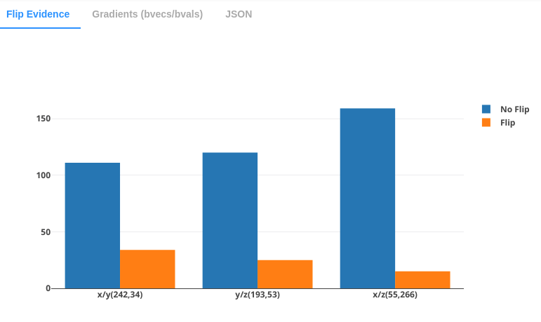
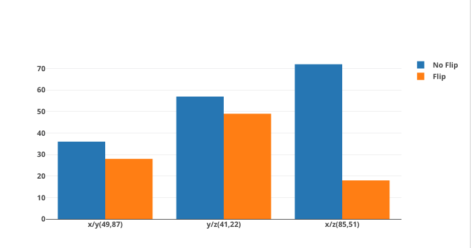
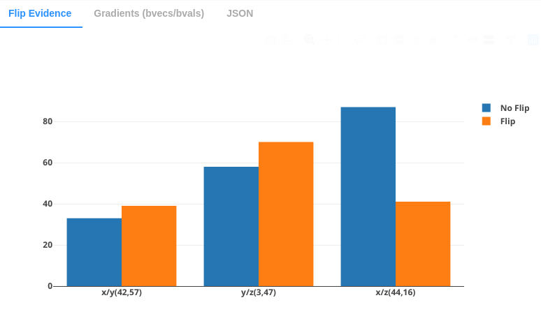

[](https://github.com/brain-life/abcd-spec)
[](https://doi.org/10.25663/bl.app.85)

# Algorithm to detect bvecs flipping

Incorrect bvecs polarity would lead to incorrect processing of DWI data. This app will quickly check the dwi image to see if any bvecs directions needs to be flipped. The algorithm find bvecs that are pointing toward certain direction and find the volume slice within 4D DWI data and see if the image indeed seems to contain features that are orthogonal to the bvecs directions.

[]
* example of y-flipped image

The algorithm requires the brain image to be aligned parallel to x/y/z axis. This App runs bets and flirt to align the data to MNI coordinate before analyzing bvecs flipping.

More detailed description of this algorithm is currently in the works.

### Authors
- Soichi Hayashi (hayashis@iu.edu)

### Project directors
- Franco Pestilli (franpest@indiana.edu)

### Funding 
[](https://nsf.gov/awardsearch/showAward?AWD_ID=1734853)
[](https://nsf.gov/awardsearch/showAward?AWD_ID=1636893)

## Running the App 

### On Brainlife.io

You can submit this App online at [https://doi.org/10.25663/bl.app.85](https://doi.org/10.25663/bl.app.85) via the "Execute" tab.

### Running Locally (on your machine)

1. git clone this repo.
2. Inside the cloned directory, create `config.json` with something like the following content with paths to your input files.

```json
{
	"dwi": "./input/dwi/dwi.nii.gz",
	"bvecs": "./input/dwi/dwi.bvecs",
	"bvals": "./input/dwi/dwi.bvals"
}
```

3. Launch the App by executing `main`

```bash
./main
```

### Sample Datasets

If you don't have your own input file, you can download sample datasets from Brainlife.io, or you can use [Brainlife CLI](https://github.com/brain-life/cli).

```
npm install -g brainlife
bl login
mkdir input
bl dataset download 5a050a00eec2b300611abff3 && mv 5a050a00eec2b300611abff3 input/dwi
```

## Output

The App will create a file `product.json` on the current working directory. This file contains following information.


```json
{
    "brainlife": [
        {
            "msg": "bvecs directions look good!",
            "type": "info"
        },
    ],
    "dwi_affine_determinant": -7.999999999999998,
    "storage_orientation": "radiological"
}
```

The product.json also contains plotly graph data so you can ploy them using ploytly or other similar libraries.

### Example of output from high SNR image


This plot shows that most slices has very low evidence of no flip.

### Example of output from low SNR / low quality image.


This plot shows that the image does not seem to be flipped, however, X/Y and Y/Z are close to being inconclusive. The image might be blurry, or has low SNR. 

### Example of output from y-flipped image.


This plot shows that x/y, y/z are flipped. Since the common axis on x/y and y/z are y, we conclude that y axis is flipped in bvecs. However the flip evidence is close to inconclusiv. The image might be blurry, or has low SNR.

### Dependencies

This App only requires [singularity](https://www.sylabs.io/singularity/) to run. If you don't have singularity, you will need to install following dependencies.  

  - fsl: https://fsl.fmrib.ox.ac.uk/fsl/fslwiki
  - python/nibabel
  - python/numpy
